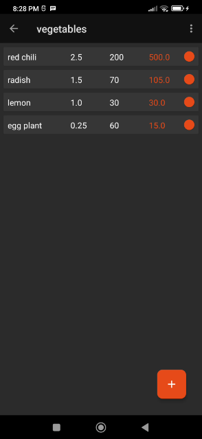

# Bazarnote

&nbsp;&nbsp;

A simple offline shopping list app

## what it is

Bazarnote is a simple note taking app geared toward shopping lists. It only keeps minimal information about items being bought offline. When going to a shop or bazaar, Bazarnote helps you keep track of all the items on your shopping list.

It is a simple offline application. Just open the app, input your shopping list, keep track of your products, and that's all.

## build the app

See the [BUILD\_INFO.org](BUILD_INFO.org) file for details.

## how to use the app

See the [USAGE.org](USAGE.org) file for details.

## contributions

  - Add features by making a <a href="https://docs.codeberg.org/collaborating/pull-requests-and-git-flow/" target="_blank">pull request</a>.
  - Help to translate to your language by making a <a href="https://docs.codeberg.org/collaborating/pull-requests-and-git-flow/" target="_blank">pull request</a>.

## license

Bazarnote - simple offline shopping list app 
Copyright (C) 2024-present M.H. Rahman Kwoshik

This program is free software: you can redistribute it and/or modify it under the terms of the GNU General Public License as published by the Free Software Foundation, either version 3 of the License, or (at your option) any later version.

This program is distributed in the hope that it will be useful, but WITHOUT ANY WARRANTY; without even the implied warranty of MERCHANTABILITY or FITNESS FOR A PARTICULAR PURPOSE. See the GNU General Public License for more details.

You should have received a [copy](LICENSE.txt) of the GNU General Public License along with this program. If not, see <https://www.gnu.org/licenses/>.

