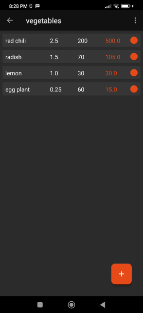

# 🛍️ Bazarnote

&nbsp;&nbsp;

Bazarnote is a **simple, offline shopping list app** built for minimalism and speed.
Stay organized while shopping—no cloud, no tracking, just your list.

## 🛒 What is it?

Bazarnote is a no-fuss shopping list app designed to be:

- ✅ Simple — Just open, add items, and shop.
- 📶 Offline-first — Works without internet.
- 🔐 Private — No data collection or syncing.
- 🛍️ Focused — Designed specifically for bazaar-style and regular grocery shopping.

With Bazarnote, you can quickly jot down items, keep track of your products and focus on shopping.

## 📱 Screenshots

<table>
  <tr>
    <td></td>
    <td></td>
  </tr>
</table>

## 📥 Download

Choose your preferred source. But IzzyOnDroid is more up-to-date and therfore preferable.

Or download the latest APK from the [Releases](https://github.com/rootminusone8004/Bazarnote/releases/).

## 🧰 Build the app from Source

Want to build Bazarnote yourself? See the [BUILD\_INFO.org](BUILD_INFO.org) file for full instructions.

## 📖 How to Use

New to Bazarnote? Check out the [USAGE.org](USAGE.org) file for a quick guide.

## 🤝 Contribute

We welcome your contributions! You can:
- ✨ Add features or fix bugs via a <a href="https://docs.github.com/en/pull-requests/collaborating-with-pull-requests/proposing-changes-to-your-work-with-pull-requests/creating-a-pull-request" target="_blank">pull request</a>.
- 🌍 Help translate Bazarnote into your language.
- 💡 Suggest ideas or improvements.

## ⚖️ License

Bazarnote - simple offline shopping list app 
Copyright (C) 2024-present M.H. Rahman Kwoshik

This program is free software: you can redistribute it and/or modify it under the terms of the GNU General Public License as published by the Free Software Foundation, either version 3 of the License, or (at your option) any later version.

This program is distributed in the hope that it will be useful, but WITHOUT ANY WARRANTY; without even the implied warranty of MERCHANTABILITY or FITNESS FOR A PARTICULAR PURPOSE. See the GNU General Public License for more details.

You should have received a [copy](LICENSE.txt) of the GNU General Public License along with this program. If not, see <https://www.gnu.org/licenses/>.